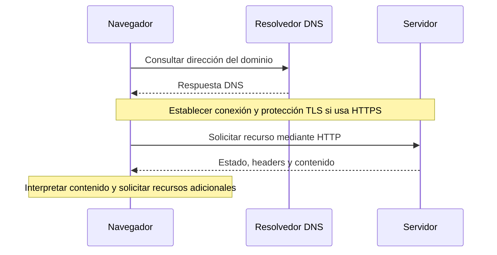

# Internet, cliente / servidor y DNS

[Volver al módulo](../README.md) · [Prácticas](../exercises/README.md)

## ¿Qué es?

Internet es una red de redes que permite comunicar dispositivos. La Web es uno de los servicios que funciona sobre esa infraestructura: conecta recursos mediante URLs y enlaces y utiliza HTTP para intercambiarlos. Correo electrónico y Web son servicios diferentes.

Tu Wi-Fi conecta el equipo a una red local; tener conexión Wi-Fi no demuestra que puedas llegar a Internet. Un router comunica redes y un proveedor de Internet conecta tu red con otras. Los datos viajan divididos en paquetes, que atraviesan equipos intermedios hasta su destino. [Referencia: MDN, funcionamiento de Internet](https://developer.mozilla.org/en-US/docs/Learn_web_development/Howto/Web_mechanics/How_does_the_Internet_work).

## ¿Por qué existe?

Una aplicación necesita comunicarse con equipos que pueden estar en otra red y usar hardware distinto. Los protocolos establecen reglas compartidas: cómo dirigir los datos, transportarlos e interpretar mensajes.

Separar responsabilidades ayuda a investigar fallos: encontrar un nombre, establecer una conexión y solicitar una página son pasos diferentes.

## ¿Cómo funciona?

### Cliente y servidor

Un cliente inicia una solicitud; un servidor escucha y responde. Son roles de programas. En el laboratorio, el navegador será el cliente y el proceso de Python será el servidor, ambos en tu computadora. Un backend también puede actuar como cliente cuando consulta otro servicio.

### Direcciones y puertos

| Concepto | Función | Ejemplo |
| --- | --- | --- |
| IP | Dirección usada para encaminar tráfico hacia una interfaz de red | `127.0.0.1` |
| Puerto | Identifica un punto de comunicación de un proceso | `8000` |
| Dominio | Nombre que puede resolverse mediante DNS | `example.com` |
| Loopback | Comunicación dentro del mismo equipo | `127.0.0.1` en IPv4, `::1` en IPv6 |

Una dirección IP no equivale necesariamente a un único sitio. Un servidor puede alojar varios dominios, y un dominio puede resolverse a varias direcciones. `localhost` designa tu propio equipo; no es una dirección pública para compartir una aplicación.

### DNS

DNS permite consultar información asociada a un nombre. Para encontrar un servidor se buscan, entre otros, registros A (IPv4) o AAAA (IPv6); CNAME indica un alias.

El equipo consulta un resolvedor. Si no hay una respuesta en caché, este puede recorrer la jerarquía DNS: raíz, dominio de nivel superior y servidor autoritativo. La caché conserva respuestas durante un tiempo relacionado con su TTL. No siempre se repite todo el recorrido. [Referencia: MDN, nombres de dominio](https://developer.mozilla.org/en-US/docs/Learn_web_development/Howto/Web_mechanics/What_is_a_domain_name).

### Anatomía de una URL

Ejemplo ilustrativo; no presupone que exista esa página:

```text
https://example.com:443/cursos?tema=http#ejercicios
```

| Parte | Valor | Significado |
| --- | --- | --- |
| Esquema | `https` | Protocolo de acceso |
| Host | `example.com` | Nombre del destino |
| Puerto | `443` | Puerto predeterminado para HTTPS; puede omitirse |
| Ruta | `/cursos` | Identifica el recurso dentro del sitio |
| Consulta | `tema=http` | Parámetros enviados al servidor |
| Fragmento | `ejercicios` | Referencia interpretada por el cliente; no se envía en la petición HTTP |

Una ruta de URL no tiene por qué corresponder a un archivo físico. El servidor decide cómo interpretarla. [Referencia: MDN, URLs](https://developer.mozilla.org/en-US/docs/Learn_web_development/Howto/Web_mechanics/What_is_a_URL).

### Del nombre a la página



Es un esquema simplificado: puede haber cachés, conexiones reutilizadas y servidores intermedios. Si escribes una IP literal como en el laboratorio, no necesitas resolver un dominio público.

## Ejemplo

En PowerShell, con conexión a Internet:

```powershell
nslookup example.com
```

Busca el nombre consultado y las direcciones devueltas. Pueden variar: anota lo observado, no memorices una IP. Si aparece un timeout, registra el fallo; no significa por sí solo que el sitio haya dejado de existir.

Después inicia el [laboratorio](../projects/browser-lab/README.md) y abre `http://127.0.0.1:8000/`. Identifica el cliente, servidor, IP y puerto. Este intercambio funciona sin consultar DNS público.

## Errores comunes

- Confundir navegador con buscador: el navegador ejecuta la navegación; el buscador es un servicio web.
- Creer que DNS descarga HTML: DNS resuelve información del nombre; HTTP solicita el recurso.
- Compartir `localhost` esperando que otra persona vea tu servidor: para esa persona apunta a su equipo.
- Interpretar un ping fallido como prueba de caída de la Web: ese tráfico puede estar bloqueado aunque HTTP funcione.
- Confundir un puerto con una carpeta o una dirección IP.

## Lo que aprendí

Después de resolver las prácticas, escribe tu explicación de cliente / servidor, un resultado real de DNS y una confusión que hayas corregido.

## Ejercicios

Resuelve los ejercicios 1 y 2 de la [guía de prácticas](../exercises/README.md). Como comprobación oral: explica qué cambia si sustituyes el puerto 8000 por uno donde no hay servidor.
